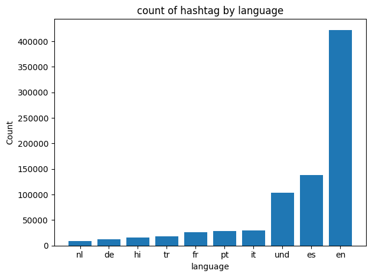
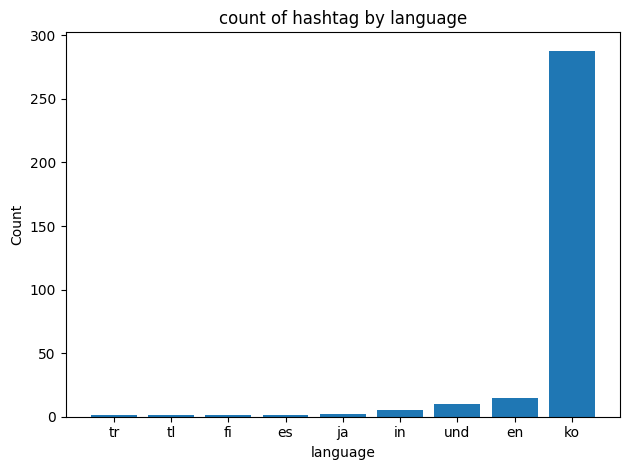
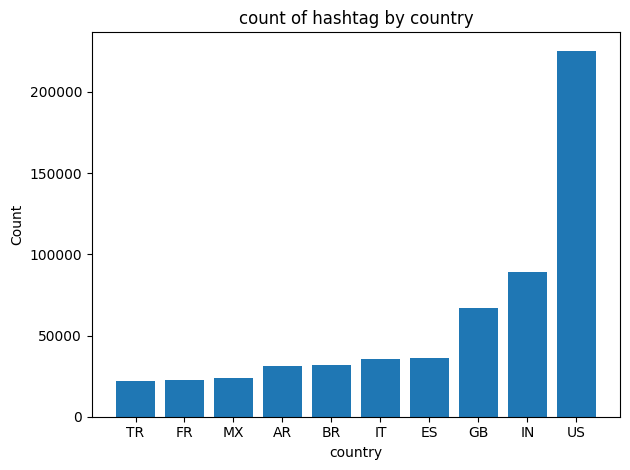
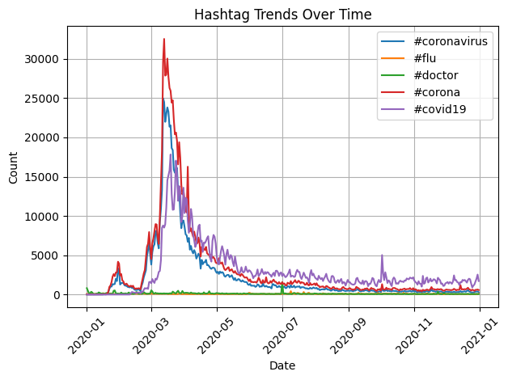

# Coronavirus Twitter Analysis

This project analyzes the spread of coronavirus-related discussions on Twitter in 2020 by processing all geotagged tweets from that year. The analysis follows a MapReduce approach to efficiently handle the large-scale dataset.

**Learning Objectives:**

1. Work with large-scale datasets
1. Process multilingual text data
1. Utilize the MapReduce paradigm for parallel processing

## Data

1. Dataset: Contains all geotagged tweets from 2020 (~1.1 billion tweets)
1. Storage: Tweets are stored in daily zip files, each containing JSON-formatted tweets
1. Processing: Extract hashtags, languages, and locations from JSON fields
## Implementation

### 1. Mapping Tweets
- `map.py`: Extracts hashtags and counts occurrences per language and country
- Outputs separate `.lang` and `.country files`

### 2. Reducing Data
- `reduce.py`: Aggregates mapped counts to get final totals

### 3. Visualization
- `visualize.py`:  Generates bar graphs of the most common hashtags by language and country
- `alternative_reduce.py`: Produces a line graph showing hashtag trends over time

## Results

The following visualizations illustrate the most common hashtags by country and language, as well as the usage trends over time:
**Count of #coronavirus by language**

**Count of #코로나바이러스 by language**

**Count of #coronavirus by country**

**Count of #코로나바이러스 by country**

**Hashtag Trends over 2020**


## Running the Analysis

1. Setup
```
git clone
cd coronavirus-twitter-analysis
```

2. Run the Mapper
```
nohup sh run_maps.sh &
```

3. Run the Reducer
```
python3 src/reduce.py --input_paths outputs/geoTwitter20-*-*.zip.lang --output_path reduced_data/langreducefull
python3 src/reduce.py --input_paths outputs/geoTwitter20-*-*.zip.country --output_path reduced_data/countryreducefull
```

4. Generate Visualizations
```
src/visualize.py --input_path=reduced_data/langreducefull --key=#coronavirus
src/visualize.py --input_path=reduced_data/countryreducefull --key=#coronavirus
src/visualize.py --input_path=reduced_data/langreducefull --key=#코로나바이러스
src/visualize.py --input_path=reduced_data/countryreducefull --key=#코로나바이러스
python3 src/alternative_reduce.py --input_paths outputs/geoTwitter20-*-*.zip.lang --keys '#coronavirus' '#flu' '#doctor' '#corona' '#covid19'  --output_path img/alternative-reduce
```

## Conclusion

This project demonstrates the power of parallel processing with MapReduce to analyze large-scale social media datasets. The results provide insights into how coronavirus-related discussions evolved over time and across different regions.
